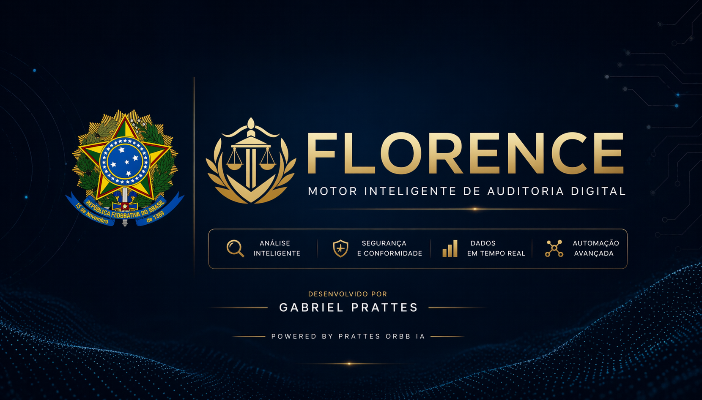

# Guia de Documentos Oficiais Florence: Legislação Digital Brasileira

## 1. Direitos Autorais
### Lei nº 9.610, de 19 de fevereiro de 1998
Altera, atualiza e consolida a legislação sobre direitos autorais e dá outras providências.
- **Link Oficial (Planalto):** [Lei nº 9.610/1998](https://www.planalto.gov.br/ccivil_03/leis/l9610.htm)

---

## 2. Assinaturas e Identidade Digital
### Medida Provisória nº 2.200-2, de 24 de agosto de 2001
Institui a Infra-Estrutura de Chaves Públicas Brasileira - ICP-Brasil, transforma o Instituto Nacional de Tecnologia da Informação em autarquia, e dá outras providências.
- **Link Oficial (Planalto):** [MP nº 2.200-2/2001](https://www.planalto.gov.br/ccivil_03/mpv/antigas_2001/2200-2.htm)

### Lei nº 14.063, de 23 de setembro de 2020
Dispõe sobre o uso de assinaturas eletrônicas em interações com entes públicos, em atos de pessoas jurídicas e em questões de saúde e sobre as licenças de softwares desenvolvidos por entes públicos.
- **Link Oficial (Planalto):** [Lei nº 14.063/2020](https://www.planalto.gov.br/ccivil_03/_ato2019-2022/2020/lei/l14063.htm)

---

## 3. Marco Civil e Proteção de Dados
### Lei nº 12.965, de 23 de abril de 2014 (Marco Civil da Internet)
Estabelece princípios, garantias, direitos e deveres para o uso da Internet no Brasil.
- **Link Oficial (Planalto):** [Lei nº 12.965/2014](https://www.planalto.gov.br/ccivil_03/_ato2011-2014/2014/lei/l12965.htm)

### Lei nº 13.709, de 14 de agosto de 2018 (LGPD)
Lei Geral de Proteção de Dados Pessoais (LGPD).
- **Link Oficial (Planalto):** [Lei nº 13.709/2018](https://www.planalto.gov.br/ccivil_03/_ato2015-2018/2018/lei/l13709.htm)

---

## 4. Provas e Documentos Digitais (Códigos)
### Código Civil (Lei nº 10.406/2002)
- **Artigos 212 e 225:** Tratam dos meios de prova e da força probatória de reproduções mecânicas e eletrônicas.
- **Link Oficial (Planalto):** [Código Civil Brasileiro](https://www.planalto.gov.br/ccivil_03/leis/2002/l10406compilada.htm)

### Código de Processo Civil (Lei nº 13.105/2015)
- **Artigos 411 e 422:** Tratam da autenticidade de documentos (inclusive eletrônicos) e da prova documental.
- **Link Oficial (Planalto):** [Código de Processo Civil](https://www.planalto.gov.br/ccivil_03/_ato2015-2018/2015/lei/l13105.htm)

---

## 5. Normas Técnicas
### ABNT NBR ISO/IEC 27037:2013
Tecnologia da informação — Técnicas de segurança — Diretrizes para identificação, coleta, aquisição e preservação de evidência digital.
- **Link de Referência (Catálogo ABNT):** [ABNT NBR ISO/IEC 27037](https://www.abntcatalogo.com.br/norma.aspx?ID=306580)
- **Nota:** Normas ABNT são documentos protegidos por direitos autorais e geralmente exigem aquisição para acesso ao texto integral.

---

Para licenciamento, parcerias ou informações comerciais:
📧 **gprattesceo@orbb.com.br** .

---
*Este guia reúne as fontes primárias ultilizadas pelo Sistema Florence consulta jurídica e técnica da aplicação.*

