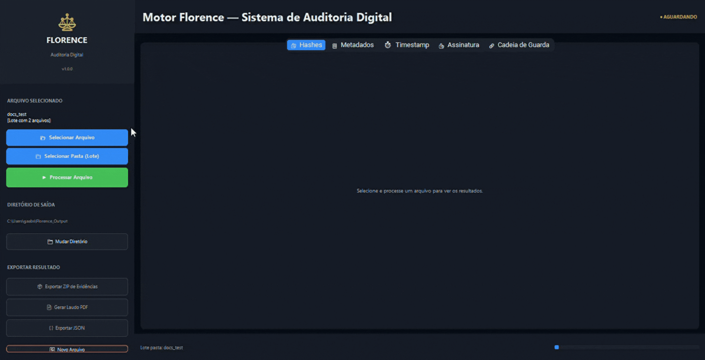

# ⚖ Motor Florence — Digital Forensic Audit Engine


> **Versão:** 1.5.0 · **Licença:** Proprietária · **Python:** 3.10+  
> **Autor:** Gabriel Prattes · **Organização:** [Prattes ORBB IA](www.orbb.com.br)

[](LICENSE)
[](https://python.org)
[]()
[]()

---


---

## 📋 Visão Geral

O **Motor Florence** é um sistema proprietário de auditoria forense digital desenvolvido para proteção e comprovação de propriedade intelectual de ativos digitais no Brasil. Combina criptografia de nível militar, timestamping seguro via NTP e geração de laudos técnico-jurídicos em conformidade com o ordenamento jurídico brasileiro.

> **Acesso ao código-fonte e documentação técnica completa disponíveis exclusivamente mediante licenciamento comercial.**
---

 
## 🛡 Processamento 100% Offline — Zero Dependência de Nuvem
 
O Motor Florence foi projetado com uma premissa inegociável: **seu ativo digital nunca sai da sua máquina.**
 
```
┌─────────────────────────────────────────────────────────┐
│              GARANTIAS DE PRIVACIDADE                   │
│                                                         │
│  ✔  Nenhum arquivo é enviado a servidores externos      │
│  ✔  Nenhuma API de terceiros processa seus dados        │
│  ✔  Nenhum dado de uso, telemetria ou log é coletado    │
│  ✔  Funciona em ambientes air-gap (sem internet)        │
│  ✔  A única saída de rede é a consulta NTP de tempo     |
└─────────────────────────────────────────────────────────┘
```
 
### Por que isso importa juridicamente?
 
Em disputas de propriedade intelectual, **a cadeia de custódia começa na coleta**. Se o arquivo auditado transitar por um servidor externo — mesmo criptografado — um advogado adverso pode questionar a integridade do processo. Com o Motor Florence, todo o pipeline criptográfico ocorre **exclusivamente em memória local**, eliminando essa vulnerabilidade processual.
 
### Modelo de Segurança
 
| Camada | Abordagem |
|--------|-----------|
| **Dados em repouso** | Chave privada isolada com permissão restrita ao titular |
| **Dados em trânsito** | Não há — nenhum dado do ativo trafega pela rede |
| **Integridade do bundle** | Merkle Tree + assinatura RSA-4096 detectam qualquer adulteração |
| **Rastreabilidade** | Cadeia de Guarda encadeada (hash-linked) e auditável |
| **Temporalidade** | Timestamp NTP verificável e imutável após assinatura |
| **Superfície de ataque** | Mínima — sem servidor, sem banco de dados, sem dependência remota |
 
### Fluxo de Dados (auditável)
 
```
[Arquivo Local]
      │
      ▼
[Motor Florence — execução local]
      │
      ├──▶ Hash Pipeline (memória) ──▶ [SHA-256 / SHA3-512 / BLAKE2b / ...]
      │
      ├──▶ Consulta NTP ────────────▶ [Timestamp assinado] ← única saída de rede
      │
      ├──▶ Assinatura RSA-4096 ─────▶ [Bundle de evidências]
      │
      └──▶ Empacotamento local ─────▶ [ZIP + Laudo PDF — tudo no seu disco]
```
 
> **Compatível com ambientes de alta segurança:** escritórios de advocacia, tribunais, órgãos públicos e empresas com políticas de zero-trust podem operar o Motor Florence em redes isoladas, substituindo apenas a consulta NTP por um servidor interno ou timestamp manual homologado.
 
---
 
## ⚖ Fundamento Jurídico
 
| Norma | Aplicação |
|-------|-----------|
| Lei nº 9.610/1998 | Lei de Direitos Autorais |
| MP nº 2.200-2/2001 | Padrão ICP-Brasil de assinatura digital |
| Lei nº 14.063/2020 | Validade de assinaturas eletrônicas |
| Lei nº 12.965/2014 | Marco Civil da Internet |
| Lei nº 13.709/2018 | LGPD |
| CC Art. 212 e 225 | Meios de prova e força probatória |
| CPC Art. 411 e 422 | Documentos digitais como prova |
| ABNT ISO/IEC 27037 | Coleta e preservação de evidências digitais |
 
---

## 🔐 Stack Tecnológica e Competências Aplicadas

### Criptografia & Segurança
- **Assinatura Digital RSA-4096** com esquema de padding PSS e hash SHA-512 (via `cryptography` / `hazmat`)
- **Pipeline multi-algoritmo de hashing**: SHA-256, SHA-512, SHA3-256, SHA3-512 (FIPS 202), BLAKE2b-512 (RFC 7693)
- **Merkle Tree** construída sobre o bundle de hashes para integridade do conjunto de evidências
- **Geração e gerenciamento de par de chaves assimétrico** com isolamento seguro da chave privada
- Codificação e serialização de evidências em **Base64 / PEM**

### Timestamping & Sincronismo Seguro
- **Consulta NTP** com múltiplos servidores redundantes e failover automático (via `ntplib`)
- Registro temporal multi-formato: **UTC ISO 8601** (microssegundos), **BRT (UTC-3)**, **Unix Epoch** (ms)
- Cálculo e registro de **offset e latência** de rede da consulta NTP
- Integração preparada para **TSP (RFC 3161)** — carimbo de tempo qualificado

### Engenharia de Software
- **Arquitetura modular Python** com separação clara entre engine, GUI e geração de relatórios
- **Cadeia de Guarda (Chain of Custody)** encadeada e auditável, com estrutura JSON resistente a adulteração
- Empacotamento de evidências em **ZIP estruturado** com manifest completo
- **API Python nativa** para integração programática sem dependência de GUI
- Suporte a **Python 3.10+** com tipagem estática e dataclasses

### Interface & Experiência
- **GUI Desktop** construída com `tkinter` — multiplataforma (Windows / macOS / Linux)
- Layout em abas com visualização segmentada de hashes, metadados, timestamp e assinatura
- Operações de **copiar hash, exportar ZIP e gerar PDF** com fluxo de um clique

### Geração de Documentos Legais
- **Laudo PDF técnico-jurídico** formatado em A4 via `ReportLab`
- Estrutura de 11 seções padronizadas, incluindo Declaração de Autenticidade, Cadeia de Guarda e Referências Legais
- Saída pronta para uso como **prova documental digital** em processos judiciais brasileiros

---
## Demostração do Sistema Florence ##


---

### Dependências Principais

| Biblioteca | Função |
|-----------|--------|
| `cryptography` | RSA-4096, PSS, geração de chaves, serialização PEM |
| `ntplib` | Consulta NTP com múltiplos servidores e fallback |
| `reportlab` | Geração de laudos PDF formatados |
| `hashlib` | SHA-256, SHA-512, SHA3-256, SHA3-512, BLAKE2b |
| `tkinter` | Interface gráfica multiplataforma |
| `zipfile` | Empacotamento do bundle de evidências |

---

## 🚀 Instalação

```bash
# Pré-requisito: Python 3.10+
pip install -r requirements.txt

# Iniciar interface gráfica
python gui_florence.py
```

---

## 💻 API Python

```python
from motor_florence import MotorFlorence
from relatorio_florence import RelatorioFlorence
from pathlib import Path

motor = MotorFlorence()
pacote = motor.processar("/caminho/para/ativo.pdf")

# Exportar evidências
motor.empacotar_zip(pacote, diretorio_saida=Path("./saida"))

# Emitir laudo PDF
RelatorioFlorence(pacote).gerar("./saida/laudo.pdf")
```

---

## 🖥 Fluxo de Uso (GUI)

```
[1] Selecionar Arquivo  →  [2] Processar  →  [3] Exportar ZIP + Laudo PDF
```

Abas disponíveis após processamento: **Hashes · Metadados · Timestamp · Assinatura Digital · Cadeia de Guarda**

---

## ⚠ Avisos Técnicos

1. **Chave RSA efêmera por sessão** — para conformidade plena com ICP-Brasil, combine com certificado A3 homologado pelo ITI.
2. **NTP ≠ carimbo qualificado** — em litígios de alta criticidade, complemente com TSP (RFC 3161) de AC homologada.
3. **O laudo não substitui perícia forense** — conforme CPC Art. 473, laudos periciais têm precedência processual.
4. **Custódia da chave privada** — responsabilidade exclusiva do titular; sua perda inviabiliza a verificação da assinatura.
---
## Documnetos Gerados : [Laudo PDF](Laudo_Florence_TESTE.pdf) | [Fundamento Jurídico](EGISLACAO.md)


## 📜 Licença

**© 2026 Gabriel Prattes — Prattes ORBB IA. Todos os direitos reservados.**

Este software é **proprietário e confidencial**. É expressamente proibido, sem autorização prévia e por escrito do titular:

- Reproduzir, copiar ou distribuir o código-fonte ou partes dele
- Modificar, adaptar ou criar obras derivadas
- Sublicenciar, vender, alugar ou transferir o software a terceiros
- Realizar engenharia reversa, descompilar ou desmontar o software

O uso deste software está condicionado à celebração de contrato de licença comercial com **Prattes ORBB IA**.

Para licenciamento, parcerias ou informações comerciais:
📧 **gprattesceo@orbb.com.br** .

---

*Motor Florence v1.5.0 — Engenharia de propriedade intelectual digital para o mercado jurídico brasileiro.*  
*Desenvolvido por **Gabriel Prattes** · Prattes ORBB IA*
